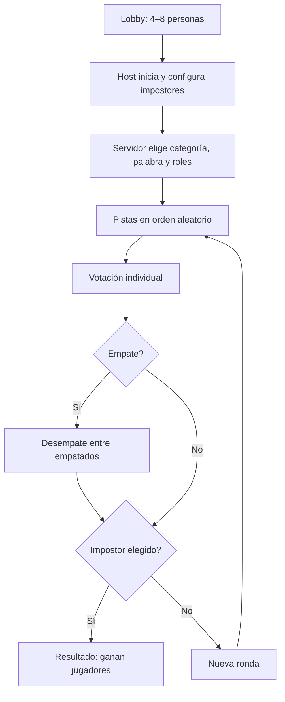
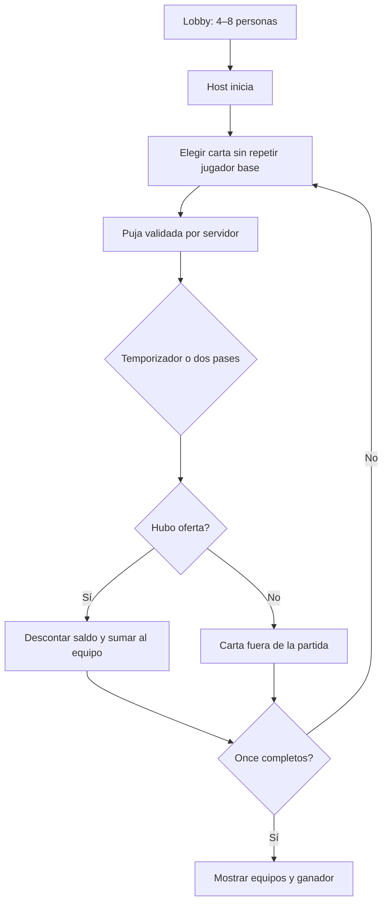

# Flujos de juego

## Infiltrado Futbolero

```mermaid
flowchart TD
  A[Lobby: 4–8 personas] --> B[Host inicia y configura impostores]
  B --> C[Servidor elige categoría, palabra y roles]
  C --> D[Pistas en orden aleatorio]
  D --> E[Votación individual]
  E --> F{Empate?}
  F -->|Sí| G[Desempate entre empatados]
  G --> H{Impostor elegido?}
  F -->|No| H
  H -->|Sí| I[Resultado: ganan jugadores]
  H -->|No| J[Nueva ronda]
  J --> D
```

## Subasta Futbolera

```mermaid
flowchart TD
  A[Lobby: 4–8 personas] --> B[Host inicia]
  B --> C[Elegir carta sin repetir jugador base]
  C --> D[Puja validada por servidor]
  D --> E{Temporizador o dos pases}
  E --> F{Hubo oferta?}
  F -->|Sí| G[Descontar saldo y sumar al equipo]
  F -->|No| H[Carta fuera de la partida]
  G --> I{Once completos?}
  H --> I
  I -->|No| C
  I -->|Sí| J[Mostrar equipos y ganador]
```
